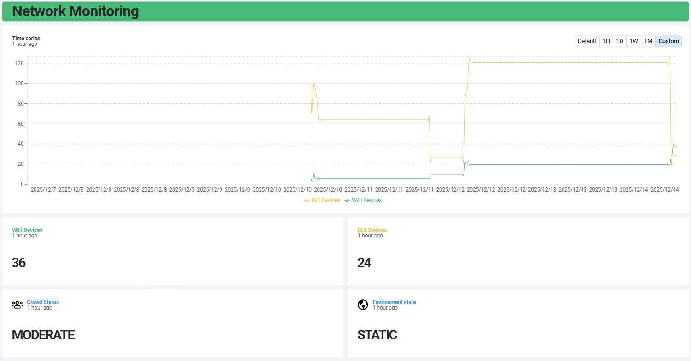

# RoomGuard –  Smart Room Occupancy Monitoring System

RoomGuard is an IoT-based indoor occupancy monitoring system that estimates room occupancy using BLE scanning, Wi-Fi scanning, and LoRaWAN communication.
The system is designed to be low-power and easy to deploy in indoor environments.

All data is transmitted via LoRaWAN to The Things Network (TTN) and visualized in real time using Datacake.

## Project Overview

RoomGuard consists of two main components:

1. Lighthouse Node  
A sensing node deployed inside a room. It passively scans BLE devices and Wi-Fi access points, estimates occupancy levels, analyzes environment dynamics, and sends compact data packets via LoRaWAN.

2. BLE Beacon Node
A simple BLE beacon used to detect the presence and RSSI of a specific device, enabling basic device tracking and validation.

## Hardware & Software Requirements

### Hardware
- **2 × Heltec LoRa32 ESP V3 Development Boards**
  - One configured as the **Lighthouse Node**
  - One configured as the **BLE Beacon Node**

### Software
- **USB driver:** CP210x USB-to-UART driver  
- **Arduino IDE**
  - Board package: *Heltec ESP32 Series Dev-Boards*
  - Required libraries: *Heltec ESP32 Dev-Boards*
- **The Things Network (TTN) account**  
  - Console: https://eu1.cloud.thethings.network/console/
- **Datacake account**  
  - Platform: https://datacake.co/

### Configuration & Documentation
- Heltec ESP32 setup guide:  
  https://docs.heltec.org/en/node/esp32/esp32_general_docs/quick_start.html

- LoRaWAN ABP connection to TTN (Heltec):  
  https://docs.heltec.org/general/lorawan_abp/connect_to_lora_server.html

- TTN integration with Datacake:  
  https://docs.datacake.de/lorawan/lns/thethingsindustries

## System Architecture

Room Environment --> Lighthouse Node -- (via LoRaWaN Uplink) --> The Things Network (TTN) --> Datacake Dashboard (Visualization)

## Repository Structure

├── lighthouse/  
│   ├── lighthouse.ino        Main RoomGuard program  
│   └── ttn_decoder_v3.json      TTN payload decoder (JSON)  
│  
├── beacon/  
│   └── beacon.ino            BLE Beacon program  
│  
└── README.md  

## Lighthouse Node (lighthouse/lighthouse.ino)

Main Functions

- Passive BLE scanning with unique device counting
- Wi-Fi access point scanning
- Crowd-level classification using threshold-based logic
- BLE beacon detection with RSSI measurement
- Environment dynamics analysis (STATIC vs MOBILE)
- Periodic LoRaWAN uplinks (every 30 seconds)

## BLE Beacon (beacon/beacon.ino)

- Broadcasts a fixed BLE device name (e.g. RG_BEACON)
- Acts as a reference device for presence detection
- Provides RSSI measurements for proximity estimation
- Enables advanced tracking and validation scenarios

## How to Use the Project

1. **Flash the Lighthouse Node (`lighthouse.ino`)**  
   - This board is placed inside the room to be monitored.  
   - It performs BLE and Wi-Fi scanning to estimate occupancy.  
   - It detects the BLE beacon and measures its RSSI.  
   - It sends all collected data to **The Things Network (TTN)** via LoRaWAN.

2. **Flash the BLE Beacon (`beacon.ino`)**  
   - This board acts as a mobile BLE beacon.  
   - It periodically advertises its BLE identifier.  
   - It can be moved between locations and rooms.

3. **Run the system**  
   - Power both boards.  
   - The Lighthouse Node scans the environment and listens for the BLE beacon.  
   - The Lighthouse Node transmits the data to **TTN**, which then forwards it to **Datacake** for visualization.

     
## Crowd-Level Classification

Room occupancy is estimated using the total number of detected wireless signals:

totalSignals = BLE_count + WiFi_count

Crowd level mapping:

- totalSignals < 20      → CALM
- 20 ≤ totalSignals < 80 → MODERATE
- totalSignals ≥ 80      → CROWDED

## Environment Dynamics Analysis (Static vs Mobile)

To determine whether the environment is static or dynamic, the system compares Wi-Fi access points detected in consecutive scan windows.

A similarity ratio is computed as:

Similarity = Number of common SSIDs / Maximum size of the two SSID sets

Decision logic:

- Similarity ≥ 50% → STATIC environment
- Similarity < 50% → MOBILE environment

## LoRaWAN Payload Format

The Lighthouse Node transmits a compact 6-byte payload:

- Bytes 0–1: Wi-Fi access point count (uint16)
- Bytes 2–3: BLE device count (uint16)
- Byte 4: Beacon RSSI (0 = not detected, >0 = abs(RSSI))
- Byte 5: Environment state (0 = Static, 1 = Mobile)

The crowd level is computed on the application side from BLE and Wi-Fi counts.

## TTN Payload Decoder

The TTN payload decoder is provided in:

lighthouse/ttn_decoder_v3.json

It decodes:

- Wi-Fi access point count
- BLE device count
- Beacon RSSI
- Environment state

Decoded data is forwarded to Datacake via TTN integration.

## Data Visualization (Datacake)

Datacake is used as the application layer for:

- Real-time visualization of BLE and Wi-Fi counts
- Crowd-level monitoring
- Beacon presence and RSSI visualization
- Environment state display (STATIC / MOBILE)
- Historical data analysis

  

  

## License

This project is released for educational purposes.
Feel free to reuse and adapt it for learning and experimentation.
